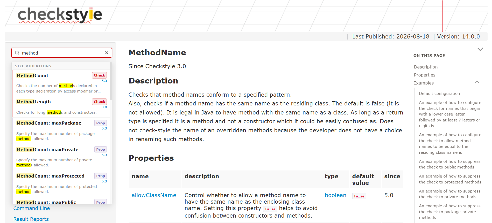
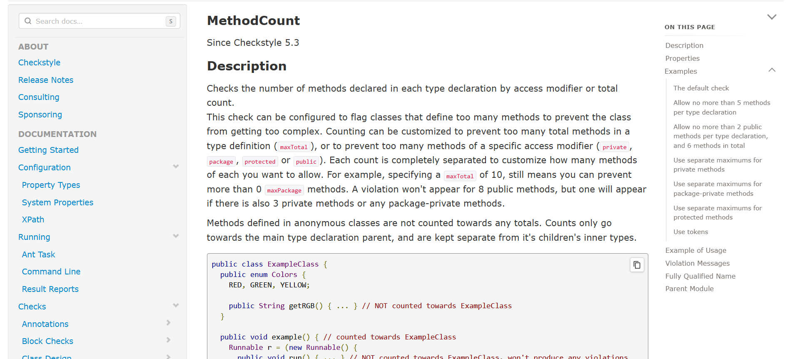
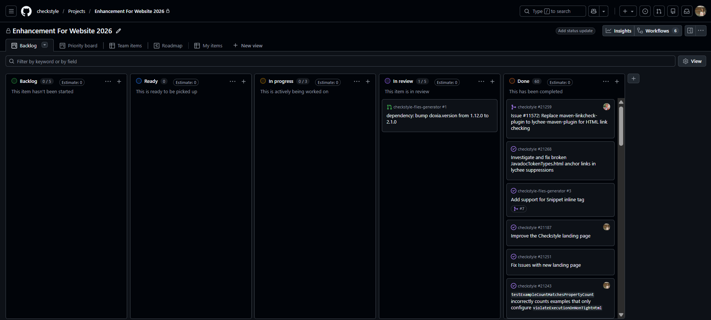

# Google Summer of Code 2026 — Checkstyle

---

**Contributor:** Smita Prajapati ([@smita1078](https://github.com/smita1078))  
**Project:** Enhancement For Website 2026  
**Mentors:** [Roman Ivanov](https://github.com/romani), [Stoyan Kostadinov](https://github.com/stoyanK7), [@Zopsss](https://github.com/Zopsss), [@kkoutsilis](https://github.com/kkoutsilis), [@baratali](https://github.com/baratali)  
**Duration:** June–August 2026  
**Organization:** Checkstyle  

**Project Proposal:** [View Original Proposal PDF](./Proposal%20GSOC2026-%20smita1078%20Enhancement%20for%20Website.pdf)

---

## Project Goals

**Project Name:** Enhancement For Website

**Background:**
During GSoC 2025, we automated significantly and now web content is taken from Java sources (javadoc of classes, tests). This year's project is designed to tackle the persistent challenge of maintaining accurate and current documentation in our dynamic development environment. Acknowledging the limitations of manual documentation processes, this initiative introduces automation to streamline content creation, with a focus on ensuring consistent formats and robust verification checks. In the previous year, we improved the experience of contributors who write new Checks/Modules. This year's goal is to provide Checkstyle users with reliable, standardized, and fully updated documentation with Examples on how to use and benefit from each setting of Check/Module. By elevating documentation practices, this project aligns with industry best practices, fostering clarity for both users and contributors within the Checkstyle project. We see a rise in Checkstyle usage in the education process, so having all documentation up-to-date and all examples working is crucial.

**Primary Goals:**

1. **Automate Documentation Maintenance** — Introduce automation to streamline content creation and ensure consistent formats with robust verification checks
2. **Provide Reliable Documentation** — Ensure Checkstyle users have standardized, fully updated documentation with working Examples for each Check/Module setting
3. **Improve User Experience** — Enhance documentation discoverability and navigation for both users and contributors
4. **Modernize Infrastructure** — Upgrade build systems and tooling to current standards

**Key Deliverables:**

- Add missed examples for all Check/Modules ([issue](https://github.com/checkstyle/checkstyle/issues))
- Make consistent all examples of Check/Modules ([issue](https://github.com/checkstyle/checkstyle/issues))
- HTML Enhancements for our website to ease navigation and user experience by search toolbar
- Fix users' complaints about our web-site ([issues](https://github.com/checkstyle/checkstyle/issues))

**Project Scope:** 175 hours (medium)  
**Mentors Assigned:** Roman Ivanov, Mauryan Kansara, kkoutsilis, stoyan, Baratali Izmailov

---

## What I Did During GSoC

### 1. AST Example Consistency & Quality Enforcement (201 PRs)

**Problem Identified:** The test suite had 228 suppressed examples, masking technical debt instead of fixing underlying issues.

**Work Completed:**
- Enhanced AST comparator to catch real inconsistencies:
    - Identifier name validation ([#20284](https://github.com/checkstyle/checkstyle/pull/20284), [#20285](https://github.com/checkstyle/checkstyle/pull/20285))
    - Line number alignment ([#20290](https://github.com/checkstyle/checkstyle/pull/20290))
    - Comment mismatch detection ([#20307](https://github.com/checkstyle/checkstyle/pull/20307), [#20317](https://github.com/checkstyle/checkstyle/pull/20317), [#20327](https://github.com/checkstyle/checkstyle/pull/20327))

- Implemented 4 new enforcement tests:
    - `testAllModuleExamplesAreBehaviorallyUnique` ([#21108](https://github.com/checkstyle/checkstyle/pull/21118))
    - `testEveryModuleHasDefaultConfigExample` ([#21129](https://github.com/checkstyle/checkstyle/pull/21130))
    - `testDefaultConfigExampleIsFirst` ([#21197](https://github.com/checkstyle/checkstyle/pull/21198))
    - `testExampleCountMatchesPropertyCount` ([#21228](https://github.com/checkstyle/checkstyle/pull/21230))

- Systematically fixed 160+ check modules through individual PRs
- Separated Examples/UseCases architecture ([#20615](https://github.com/checkstyle/checkstyle/pull/20615), [#20983](https://github.com/checkstyle/checkstyle/pull/20983))

**Result:** Achieved 94% suppression reduction (228 → 10), with examples now serving as executable regression tests

---

### 2. Client-Side Search Implementation (6 PRs)

**Problem Identified:** 300+ documentation pages with no search functionality forcing users to rely on browser Ctrl+F or external search engines.

**Work Completed:**
- Built `SearchIndexGenerator.java` - Maven utility that:
    - Walks xdocs during build and extracts metadata
    - Generates 2,500+ indexed entries
    - Uses camelCase splitting for keyword generation

- Implemented `search.js` with:
    - Real-time filtering with scoring tiers
    - Keyboard navigation (s, ↑↓Enter)
    - Color-coded results by category

- Refined search functionality:
    - [#20480](https://github.com/checkstyle/checkstyle/pull/20509) — Review feedback
    - [#21054](https://github.com/checkstyle/checkstyle/pull/21087) — Badge improvements
    - [#21089](https://github.com/checkstyle/checkstyle/pull/21092) — Excluded code snippets
    - [#21097](https://github.com/checkstyle/checkstyle/pull/21103) — Excluded release notes

**Result:** Full-text search deployed across entire documentation site with 2,500+ indexed entries

---

### 3. Table of Contents Navigation (6 PRs)

**Problem Identified:** Check documentation pages (10-20 sections each) had no in-page navigation, forcing users to scroll manually.

**Work Completed:**
- Implemented `TocMacro.java` - Doxia macro that:
    - Scans `.xml.template` files for section IDs
    - Renders styled TOC div with anchor links
    - Executes at build time

- Added quality enforcement:
    - [#21069](https://github.com/checkstyle/checkstyle/pull/21076) — Descriptive text test
    - [#21202](https://github.com/checkstyle/checkstyle/pull/21204) — Title extraction fixes
    - [#21216](https://github.com/checkstyle/checkstyle/pull/21224) — UseCase support

**Result:** "In This Article" sidebar deployed across 300+ documentation pages

---

### 4. CI/CD & Infrastructure Modernization (14 PRs)

**Workflow Consolidation:**
- Reduced 4 separate jobs → 1 consolidated job ([#21188](https://github.com/checkstyle/checkstyle/pull/21188))
- Extracted `.ci/site.sh` for reusable scripting

**Doxia 2.1.0 Migration:**
- Upgraded documentation build system: [checkstyle-files-generator#17](https://github.com/checkstyle/checkstyle-files-generator/pull/17)

**Link Checking Modernization:**
- Migrated maven-linkcheck-plugin → lychee-maven-plugin ([#21259](https://github.com/checkstyle/checkstyle/pull/21259))
- Achieved 10-100x speed improvement (5-10 min → 30-60 sec)

**Extended File Support:**
- Added non-Java file config support ([#21008](https://github.com/checkstyle/checkstyle/pull/21008))

**Stricter Validation:**
- Enforced violation comment formats ([#20951](https://github.com/checkstyle/checkstyle/pull/20951))
- Added first/last line pattern support ([#20345](https://github.com/checkstyle/checkstyle/pull/20345))

**Result:** Modernized tooling, faster CI/CD, improved maintainability

---

### 5. Bug Fixes & Improvements (28 PRs)

- Fixed JavaScript TypeError ([#21122](https://github.com/checkstyle/checkstyle/pull/21122))
- Resolved broken documentation links ([#20879](https://github.com/checkstyle/checkstyle/pull/20879), [#20618](https://github.com/checkstyle/checkstyle/pull/20618))
- Added missing property examples for 10+ modules
- Test-Configs repository improvements ([test-configs#248](https://github.com/checkstyle/test-configs/pull/248), [test-configs#256](https://github.com/checkstyle/test-configs/pull/256))

---

## 📸 Visual Overview

*Real-time search across 2,500+ indexed entries with color-coded results*

*"In This Article" sidebar deployed across 300+ documentation pages*

*GitHub Projects board organizing all 260+ PRs by work theme*

---

## Current Status and Impact

### Completed Deliverables
- ✓ **260+ PRs merged** across 3 repositories
- ✓ **60+ issues closed**
- ✓ **94% suppression reduction** (228 → 10 examples)
- ✓ **2,500+ searchable entries** indexed and live
- ✓ **300+ documentation pages** with TOC navigation
- ✓ **Doxia 2.1.0 migration** completed
- ✓ **~8,000 lines** of code written
- ✓ **250+ hours** delivered (vs 175 planned)

### Metrics Summary

| Metric | Value | Status     |
|--------|-------|------------|
| PRs Merged | 260+ | ✓ Complete |
| Issues Closed | 60+ | ✓ Complete |
| Suppression Reduction | 94% (228→10) | ✓ Complete |
| Searchable Entries | 2,500+ | ✓ Live     |
| Pages with TOC | 300+ | ✓ Live     |
| Code Written | ~8,000 lines | ✓ Complete |
| Project Hours | 250+ (175 planned) | ✓          |

---

## What I Learned During GSoC

### Technical Skills

**Xdocs Macro Development**
- Learned how Maven Doxia macros work and generate HTML at build time
- Developed build-time code generation skills

**AST Comparison & Validation**
- Deep dive into Checkstyle's token types and AST structures
- Implemented structural equivalence validation

**Client-Side Search**
- Real-time filtering on large datasets
- Scoring algorithms and ranking systems

**CI/CD Architecture**
- Consolidating workflows for efficiency
- Modern tool selection and system modernization

**Documentation as Code**
- Examples are executable regression tests
- Automated validation ensures documentation accuracy

### Non-Technical Skills

**Project Management**
- Structured approach to large-scale refactoring
- Organized work by priority and dependencies
- Coordinated work across multiple repositories

**Effective Communication**
- Collaborated with mentors on clarifying requirements
- Explained technical decisions in PR descriptions
- Handled disagreements constructively

**Teamwork and Collaboration**
- Appreciated different perspectives from experienced mentors
- Learned from detailed code reviews
- Contributed to a welcoming open-source community

**Problem-Solving**
- Systematically approached complex problems
- Found creative solutions within technical constraints

---

## Code Contributions

**All PRs by Category:**
- **AST & Suppression Fixes:** [160+ module PRs](https://github.com/checkstyle/checkstyle/pulls?q=is%3Apr+author:smita1078+"Fix xdocs Examples AST Consistency Test")
- **Search Implementation:** [#20331](https://github.com/checkstyle/checkstyle/pull/20331), [#20480](https://github.com/checkstyle/checkstyle/pull/20509), [#20601](https://github.com/checkstyle/checkstyle/pull/20618)
- **TOC Navigation:** [#20593](https://github.com/checkstyle/checkstyle/pull/20593), [#21069](https://github.com/checkstyle/checkstyle/pull/21076), [#21202](https://github.com/checkstyle/checkstyle/pull/21204)
- **CI/CD & Infrastructure:** [#21188](https://github.com/checkstyle/checkstyle/pull/21188), [#21259](https://github.com/checkstyle/checkstyle/pull/21259), [#21008](https://github.com/checkstyle/checkstyle/pull/21008)

**Complete Lists:**
- [All 260+ merged PRs](https://github.com/checkstyle/checkstyle/pulls?q=is:pr+author:smita1078+is:merged)
- [Project board](https://github.com/orgs/checkstyle/projects/17)

**Key Code Files:**
- SearchIndexGenerator: [source](https://github.com/checkstyle/checkstyle/blob/master/src/main/java/com/puppycrawl/tools/checkstyle/site/SearchIndexGenerator.java)
- TocMacro: [source](https://github.com/checkstyle/checkstyle/blob/master/src/main/java/com/puppycrawl/tools/checkstyle/site/TocMacro.java)
- XdocsExamplesAstConsistencyTest: [source](https://github.com/checkstyle/checkstyle/blob/master/src/test/java/com/puppycrawl/tools/checkstyle/internal/XdocsExamplesAstConsistencyTest.java)

---

## Acknowledgements

I would like to express my deepest gratitude to my mentors, [Roman Ivanov](https://github.com/romani), [Stoyan Kostadinov](https://github.com/stoyanK7) and Mauryan Kansara, for their unwavering support and guidance throughout this project. Their clear direction and constructive feedback helped me navigate complex challenges and deliver high-quality solutions.

Special thanks to the entire Checkstyle community for their detailed reviews and supportive environment.

This GSoC experience has significantly enhanced my skills in both technical implementation and collaborative development. I am looking forward to continuing my contributions to Checkstyle.

---

**Links:**
- **GitHub:** https://github.com/smita1078
- **Medium:** https://medium.com/@smita.prajapati082
- **Project Board:** https://github.com/orgs/checkstyle/projects/17
- **All PRs:** https://github.com/checkstyle/checkstyle/pulls?q=is:pr+author:smita1078+is:merged
